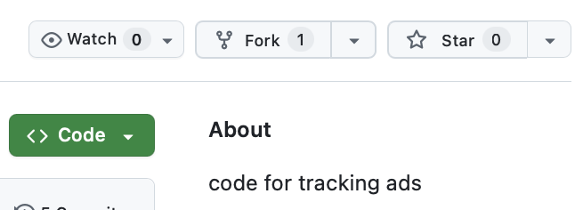
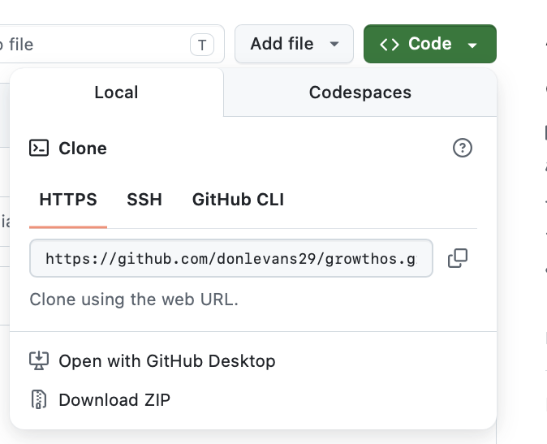

# Code for Tracking Ads
Hello everyone

---

## 🚀 Getting Started

### 1. Install Required Software
Download and Install (if haven't already!)
- Visual Studio Code
- Git
- Terminal

### 2. Configure Git
Open your terminal and run:

```
git config --global user.name "Your GitHub username"
git config --global user.email "Your GitHub email"
```

This makes sure your work is tracked correctly

---

## 📂 Understanding Files
The **Root Folder** is the main prject directory, all files and folders asre stored inside it

---

## 💻 Basic Terminal Commands
These are some of the basic commands you will use:
- Create a file

```
touch filename
```

- Create a folder

```
mkdir foldername
```

- List files

```
ls
```

- Open project in VS Code

```
code .
```

- Check changes

```
get status
```

---

## ✅ Basic Skills Checklist
Before continuing you should be able to
- Connect your GitHub account to VS Code
- Clone a repository
- Edit files locally
- Commit and push chnages to overwrite the files in the main project

---

## ⚠️ Common Issues
- Check spelling of commands carefully
- Make sure Git is installed before running commands

---

## 🤝 Contributing
To contribute to this project:
- Fork the repository


  

- Clone it to your computer


  

- Make your changes
- Push your changes
- Submit a pull request

---

## ❓ Need Help
If you are unsure about anything:
- Search online for the command
- Check GitHub documentation
- Ask for help form others

---
